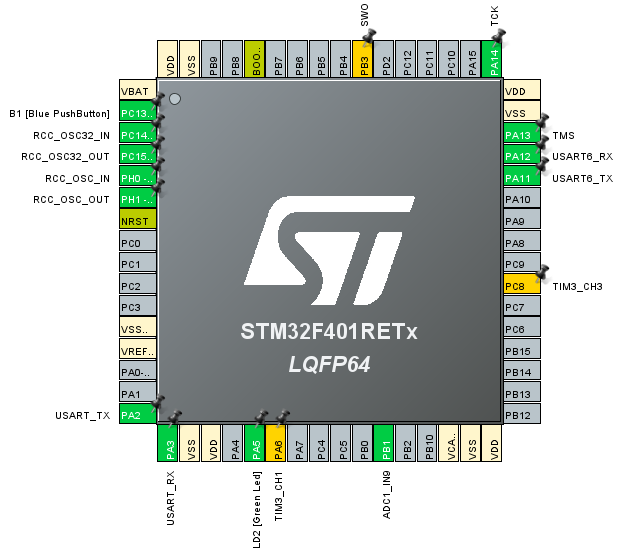

# ECE-298 Reservoir Simulator

A comprehensive reservoir simulator system designed and built using an STM32 Nucleo board to emulate water flow management in a controlled reservoir environment.

---

## 🏗️ What is this project?

This project features a fully integrated reservoir simulation platform that:

- Measures real-time water level and displays the percentage full.
- Controls water flow direction and simulates water pumping.
- Monitors pump speed, indicates flow direction, and transmits live measurements to a computer via UART.
- Models practical water management and feedback control scenarios using embedded systems.

---

## ⚙️ How does it work?

The simulator is powered by an STM32 microcontroller, programmed in C, and incorporates:

- **Servo Motor:** Controls flow direction (simulates outlet switching).
- **DC Motor:** Drives the water pump, with speed monitored by an RPM sensor.
- **Ultrasonic Sensor:** Measures water level with high accuracy.
- **RGB LED:** Provides visual status indicators.
- **Custom Timer PCB:** Drives a seven-segment display for real-time feedback.
- **UART Connection:** Streams sensor data and system state to a computer for monitoring and analysis.

*STM32F401RETx microcontroller pinout used as the system's central unit.*

---

## 🖥️ System Architecture

- **Embedded C Code:** Collects and processes sensor data, manages actuator control, and implements feedback logic for accurate reservoir simulation.
- **Real-Time Feedback:** Water level, flow direction, and pump speed are displayed and logged for live monitoring.

*Example of real-time UART output: water level, flow direction, and pump speed logged at regular intervals.*

---

## 🛠️ Hardware Overview

### Components
- STM32 Nucleo Board (F401RE)
- Servo Motor
- DC Motor
- Ultrasonic Distance Sensor (HC-SR04)
- RPM Speed Sensor
- RGB LED
- Custom Timer PCB for seven-segment display
- Breadboard, jumper wires, and supporting electronics

*Hardware setup: STM32 Nucleo board, custom PCB, sensors, and actuators assembled for simulation.*

.PNG)
*Custom-designed PCB for accurate timer and display control.*

---

## 🏆 Results

- Achieved a **fully functional reservoir simulator** capable of displaying real-time water level percentage and simulating advanced flow control.
- Enabled **accurate and responsive feedback** on reservoir conditions using integrated sensor data, motor control, and UART communication.
- Demonstrated **effective integration of embedded systems** with sensors and actuators for hands-on modeling of practical water management.

---

## 📦 Repository Structure

- `/src` — Source code for STM32 (C)
- `/hardware` — Schematics, PCB design files, and hardware diagrams
- `/docs` — Additional documentation and test results
- `/images` — Project photos and diagrams

---

## 💡 Key Features

- Real-time water level measurement and display
- Dynamic flow direction control via servo motor
- Pump speed monitoring and feedback
- UART-based data transmission for live system monitoring
- Modular hardware for rapid prototyping and testing

---
